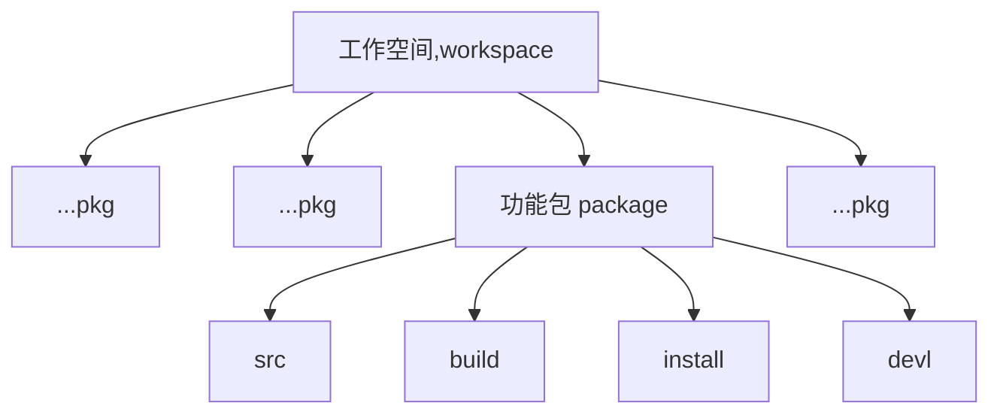

ROS 入门
# 01 Turtle移动基础
### 01.1传统方法（打开多个Terminal)
1. ROS1 每次启动都需要用的一个`roscore，在Terminal中输入
   ```SHELL
   roscore
   ```
   当输入`roscore`显示`Command 'roscore' not found...`时，说明我们的`ros`没有。输入如下命令返回为空
   ```SHELL
   echo $ROS_PACKAGE_PATH
   ```
   添加到环境变量之中，需要在Terminal 如下操作,从而增加环境变量。重复上述操作，会有输出。
   ```SHELL
   source /opt/ros/melodic/setup.bash
   echo $ROS_PACKAGE_PATH
   ```
   输出`/opt/ros/melodic/share`说明该位置的ROS变量(也就是ROS命令或者功能包)已经添加到环境变量当中。再执行`roscore`程序运行。
   
3. 打开一个新的Terminal,启动一个海归仿真器,海归仿真器`turtlesim`是一个功能包，启动功能把需要用`rosrun`。`turtlesim_node`为仿真节点
   ```SHELL
   rosrun turtlesim turtlesim_node
   ```
4. 打开一个新的Terminal,它也是一个节点
   ```SHELL
   rosrun turtlesim turtle_teleop_key
   ```
5. 打开一个新的Terminal,rqt工具来查看之间的关系
   ```SHELL
   rqt_graph
   ```
6. 打开新的Terminal，也可以通过命令行查看节点具体信息
   ```SHELL
   rosnode list
   ```
### 01.2利用Launch文件一次性打开
`.launch`文件是一种启动文件，可以将多个命令合并启动。将上述代码整合到一个`.launch`文件。
   ```html
   <launch>
    <node pkg="turtlesim" name="turle_sim" type="turtlesim_node"/>
    <node pkg="turtlesim" name="turle_mov" type="turtle_teleop_key"/>
    <node pkg="rqt_graph" name="rqt_graph" type="rqt_graph"/>
   </launch>
   ```
大家可以不输入`name`属性后面跟的取值让其为空`”“`,通过`rosnode list`查看具体节点名称，发现系统会自动分配名称。但是不建议如此使用

## 02 创建学习空间于功能包
### 02.1 创建工作空间

1. 首先我们要创建一个文件夹
   ```SHELL
      mkdir -p ~/catkin_ws/src
   ```
2. 到相应的`src`文件夹下
   ```SHELL
      cd ~/catkin/src
   ```

3. 初始化
   ```SHELL
      catkin_init_workspace
   ```
   通过初始化工作空间，在src文件夹下就会出现 CMakeLists.txt的文件。

4. 编译

   退回到`catkin_ws`文件夹下，编译工作空间
   ```SHELL
      cd ~/catkin_ws
      catkin_make
   ```
   编译成功后`catkin_ws`工作空间文件夹下会出现`src`,`devel`,`launch`,`src` 文件夹，但是没有出现`Install`
   可以通过将`catkin_make`换成`catkin_make install`
5. 查看环境变量，
   ```SHELL
   echo $ROS_PACKAGE_PATH
   ```
   如果没有任何反馈证明该值为空，执行前确保当前路径为`~/catkin_ws/`
   ```SHELL
   source ./devel/setup.sh
   ```
   然后再添加环境变量后执行`source devel/setup.sh`就有相应的返回值。
### 02.2创建功能包
   ROS下，源代码都必须在功能包下才能编译运行。需要把源代码放到`src`文件夹下。其实功能包大家并不陌生，如日'turtlesim'就是一个功能包，而后面的'turtlesim_node'和'turlte_teleop_key'就是功能包下的节点。一个工作空间下可以有好些功能包。
1. 创建功能包   
   ```SHELL
   catkin_create_pkg test_pkg std_msgs rospy roscpp
   ```
   其中，功能包名称为test_pkg,依赖的包有std_mgs、rospy、roscpp
   如果该步骤出现,如下错误，很有可能是没有把ROS自带的命令添加到环境当中
   ```SHELL
   usage: catkin_create_pkg [-h] [--meta] [-s [SYS_DEPS [SYS_DEPS ...]]]
                         [-b [BOOST_COMPS [BOOST_COMPS ...]]] [-V PKG_VERSION]
                         [-D DESCRIPTION] [-l LICENSE] [-a AUTHOR]
                         [-m MAINTAINER] --rosdistro ROSDISTRO
                         name [dependencies [dependencies ...]]
   catkin_create_pkg: error: argument --rosdistro is required

   ```
   在Terminal中执行`source /opt/ros/melodic/setup.bash`后再执行上述操作，重新创建功能包。
   
3. 退回到工作空间目录进行编译
   ```SHELL
   cd ~/catkin
   catkin_make
   ```
   编译成功后将新的工作空间的路径添加到系统变量当中,这样系统才能识别出工作空间下的变量。
   ```SHELL
   source ~/catkin_ws/devel/setup.sh
   ```

