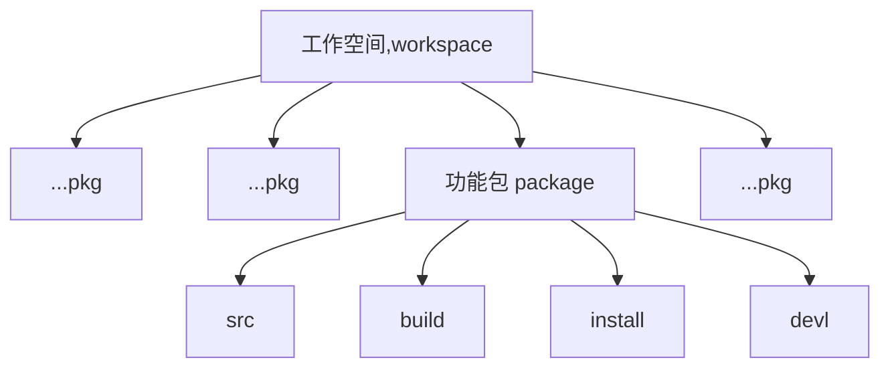

ROS 入门
# 01 Turtle移动基础
### 01.1传统方法（打开多个Terminal)
1. ROS1 每次启动都需要用的一个`roscore，在Terminal中输入
   ```SHELL
   roscore
   ```
2. 打开一个新的Terminal,启动一个海归仿真器,海归仿真器`turtlesim`是一个功能包，启动功能把需要用`rosrun`。`turtlesim_node`为仿真节点
   ```SHELL
   rosrun turtlesim turtlesim_node
   ```
3. 打开一个新的Terminal,它也是一个节点
   ```SHELL
   rosrun turtlesim turtle_teleop_key
   ```
4. 打开一个新的Terminal,rqt工具来查看之间的关系
   ```SHELL
   rqt_graph
   ```
5. 打开新的Terminal，也可以通过命令行查看节点具体信息
   ```SHELL
   rosnode list
   ```
### 01.2利用Launch文件一次性打开
`.launch`文件是一种启动文件，可以将多个命令合并启动。将上述代码整合到一个`.launch`文件。
   ```html
   <launch>
    <node pkg="turtlesim" name="turle_sim" type="turtlesim_node"/>
    <node pkg="turtlesim" name="turle_mov" type="turtle_teleop_key"/>
    <node pkg="rqt_graph" name="rqt_graph" type="rqt_graph"/>
   </launch>
   ```
大家可以不输入`name`属性后面跟的取值让其为空`”“`,通过`rosnode list`查看具体节点名称，发现系统会自动分配名称。但是不建议如此使用

## 02 创建学习空间于功能包
### 02.1 创建工作空间

1. 首先我们要创建一个文件夹
   ```SHELL
      mkdir -p ~/catkin_ws/src
   ```
2. 到相应的`src`文件夹下
   ```SHELL
      cd ~/catkin/src
   ```

3. 初始化
   ```SHELL
      catkin_init_workspace
   ```
   通过初始化工作空间，在src文件夹下就会出现 CMakeLists.txt的文件。

4. 编译

   退回到`catkin_ws`文件夹下，编译工作空间
   ```SHELL
      ccd ~/catkin_ws
      catkin_make
   ```
   编译成功后`catkin_ws`工作空间文件夹下会出现`src`,`devel`,`launch`,`src` 文件夹，但是没有出现`Install`
   可以通过将`catkin_make`换成`catkin_make install`
5. 查看环境变量，添加变量
   ```SHELL
   source devel/setup.sh
   ```
   如果没有任何反馈证明该值为空，执行前确保当前路径为`~/catkin_ws/`
   ```SHELL
   source ./devel/setup.sh
   ```
   然后再添加环境变量后执行`source devel/setup.sh`就有相应的返回值。
### 02.2创建功能包
ROS下，源代码都必须在功能包下才能编译运行。需要把源代码放到`src`文件夹下


 

